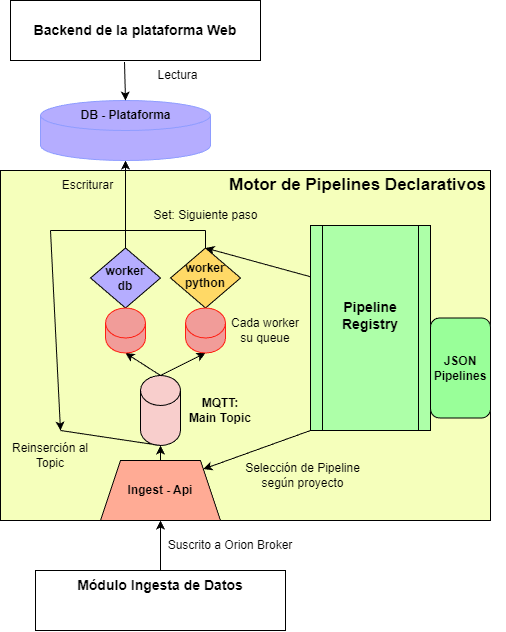

# Declarative Pipeline Engine
La Declarative Pipeline Engine es una implementación propia y ligera de un sistema de pipelines declarativos. Inspirado en soluciones comúnmente usadas en IoT como thingsboard. Su principal funcionalidad es la de implementar un sistema en el que un conjunto de administradores (Miembros Techlab) puedan definir el procesamiento de datos de forma declarativa mediante archivos .json de forma declarativa.

Es decir, en lugar de cambiar la implementación ante la inclusión de nuevos proyectos, actualización en el flujo de información deseado, implementación de nuevas transformaciones de datos, cambios de almacenamiento, etc. Los administradores podrán simplemente subir un nuevo archivo .json con el nuevo pipeline.

Los pipelines definen pasos por el que cada dato puede pasar. Actualmente, se disponen `workers`, los cuales abordan estos pasos. Uno para transformación mediante scripts python y otro para la escritura en base de datos. Un dato es recibido por el sistema, en un api-rest, revisa el pipeline definido para ese tipo de dato, y procede a fluir a través de los workers hasta cumplir con el pipeline definido. 




## Sub módulos del motor


### 1. ingest_api

API REST la cual recibe la información en el endpoint `/orion/notify`. Tras recibir la información, invoca al `pipeline_registry` o a un Mock, preguntándo por el pipeline del dato. La información adicional correspondiente al pipeline, versión y configuración del siguiente paso en el pipeline son adjuntados al dato. Finalmente, publica en el topic RabbitMQ: `pipeline`, en la subdirección correspondiente al siguiente paso.

La implementación de este submódulo se encuentra en la carpeta `/ingest_api`. En esta se encuentra el Dockerfile del submódulo, junto con el `package.json`. 

También puede ejecutarse localmente con:

```bash
npm install
node src/app.js
```

El puerto del servidor es pasado como variable de entorno (Revisar los archivos`docker-compose`)

### 2. pipeline_registry

API REST la cual gestiona y sirve los pipelines del sistema. En este se monta la carpeta `artifact_files`, de donde se leen los archivos de pipelines en .json. Gestiona el versionamiento de pipelines (pendiente), a fin de que si un pipeline es actualizado en tiempo de ejecución mientras hay datos aún usando un pipeline ahora obsoleto, estos puedan terminar su flujo con el pipeline con el que fueron introducidos al sistema. 

El API REST responde por los siguientes pasos del pipeline, o el pipeline usado para determinado proyecto en sus endpoints:

- Siguiente paso del pipeline (Se especifica versión y paso actual con stepId)
`/pipeline/:pipeline/:version/:stepId/next`

- Pipeline usado actualmente por determinado proyecto (projectName)
`/project/:projectName`

- Volver a leer los pipelines (actualización) [Pendiente a actualización]
`/update`

La implementación de este submódulo se encuentra en `/pipeline_registry`. Carpeta que también contiene un Dockerfile y `package.json`

Puede ejecutarse localmente con:
```bash
npm install
node src/app.js
```

El puerto del servidor es pasado como variable de entorno (Revisar los archivos`docker-compose`)

### 3. workers

Los workers son módulos que pueden ser usados en cada paso de pipeline. Estos tienen una cola RabbitMQ la cual escucha por los mensajes publicados en el topic general `pipeline` y que estén dirigidos para cada worker en específico. 

Estos reciben la información, la procesan, preguntan por el siguiente paso en el pipeline a `pipeline_registry` y republican en el topic `pipeline` con la subdirección correspondiente para abordar el siguiente paso. En caso no haber siguiente paso (Paso final), el enrutamiento es saltado. 

Ambos workers definen sus variables de entorno con los archivos en las carpetas `config_files`. Estos archivos no están incluidos en el repositorio, y deben ser creados al momento de ejecución siguiente el ejemplo .sample (Similar a un .env), el cual es montado dentro de la imagen docker. 

En un futuro pueden implementarse más dockers para abordar nuevo tipo de aplicaciones con otros servicios o implementaciones. Parte de los archivos genéricos (Consumo y publicación con RabbitMQ) se encuentra en la carpeta `/wrkers/shared`. Código que puede importarse para implementar otro worker en python. En caso de usar otros lenguajes para implementar un worker, deberán implementarse las mismas funciones básicas del worker.

#### 3.1 worker_python

Worker diseñado para aceptar scripts ajenos al sistema: Archivos .py que serán incluidos en la carpeta `artifact_files`. El propósito de este módulo es permitir a los administradores de la plataforma incluir scripts personalizados para el procesamiento o generación de información de cada proyecto, sin necesidad de tocar la implementación del resto del sistema. Sólo requerirán escribir un script siguiendo una determinada estructura y el sistema podrá consumirlo como paso (Definido en su pipeline).

#### 3.2 worker_db

Worker diseñado para escribir en la base de datos (PostgreSQL) de la información generada por los proyectos. La escritura es dinámica, es decir, acepta como argumentos como la tabla en la que se guardará la información, e información sobre el esquema de esta. Esta información es definida dentro del pipeline declarativo. Es tratado como nodo final.

La información de la conexión se encuentra como variable en el archivo de configuración en `config_files/worker-db`.


### Topic Pipelines (Rabbit MQ)

El topic `pipelines`, es un topic de Rabbit MQ. Puede entenderse como un pipeline central, por el que pasan todos los datos y luego son direccionados a las colas del worker que corresponde al siguiente paso (Subdirecciones). Todos los elementos del sistema de pipelines declarativos (ingest_api y los workers) publican en este topic central, adjuntando la subdirección del submódulo del siguiente paso. 

Cada submódulo receptor de información (Por ejemplo los workers) crea una cola propia en la que se acumulan los datos para ser procesados uno a uno por el worker. 

```text
                        ┌────────────────────┐
                        │   Publicador, ejm: │
                        │ ingest-api/worker  │
                        └─────────┬──────────┘
                                  │publish
                                  v
                        ┌─────────────────────┐
                        │   'pipelines'Topic  │
                        └─────────┬───────────┘
                                  │subaddress
                 ┌────────────────┼────────────────┐
                 │                │                │
                 v                v                v
        ┌────────────────┐  ┌────────────────┐  ┌────────────────┐
        │ queue: workerdb│  │ queue: workerpy│  │ queue: worker-3│
        └───────┬────────┘  └───────┬────────┘  └───────┬────────┘
                │                   │ read              │
                v                   v ack               v
        ┌────────────────┐  ┌────────────────┐  ┌────────────────┐
        │  worker-db     │  │  worker-python │  │ worker -3      │
        └────────────────┘  └────────────────┘  └────────────────┘
```

## Instalación Docker

Este proyecto incluye **dos archivos de Docker Compose**:

- `docker-compose-build.yml`
- `docker-compose.yml`

### 1) Build de imágenes (`docker-compose-build.yml`)

El archivo `docker-compose-build.yml` se utiliza **únicamente para construir (build) las imágenes**.

Ejecuta el build con:

```bash
docker compose -f docker-compose-build.yml build
```

Las imágenes resultantes pueden ser:

- Ejecutadas localmente

- Transferidas y utilizadas en una instancia EC2

### 2) Ejecución de contenedores (docker-compose.yml)

El archivo docker-compose.yml se utiliza para levantar los contenedores a partir de las imágenes ya construidas.

⚠️ Importante: el archivo docker-compose.yml debe estar ubicado en la misma carpeta que los artefactos artifact_files y config_files (descritos en la siguiente sección), ya que estas carpetas se montan como volúmenes dentro de algunos contenedores.

Para esto se deben crear dichas carpetas tal cual están en el repositorio de github. Si usaste git-clone no deberías tener problemas. Si)n embargo, estas deben ser creadas manualmente en la instancia, al sólo subirse las imágenes y no el resto del repositorio.

Ejecuta los servicios con:

```bash
docker-compose up -d
```

#### Verificación de instalación

Sabremos que la instalación fue correcta cuando todos los contenedores estén corriendo y en estado healthy:

- rabbitmq

- pipeline-registry

- ingest-api

- worker-db

- worker-python

## Archivos de Configuración y Artefactos

Junto al archivo `docker-compose` que ejecuta las imágenes, deben encontrarse 2 carpetas con la siguiente estructura:

```text
├── docker-compose.yml
├── artifact_files/
│   └──pipelines/
│      ├── cuenta_personas.json
│      └── parking.json
└── config_files/
    ├── worker-db/
    │   └── config.py
    └── worker-python/
        └── config.py
```

#### artifact_files

La carpeta `artifact_files` contiene los pipelines (y próximamente los esquemas) registrados por el pipeline_registry. Aquí los miembros del techlab podrían subir sus pipelines declarativos en .json definiendo así el flujo de datos sin necesidad de tocar la implementación del sistema. El modelo usado actualmente puede encontrarse como archivos .sample 

Esta carpeta es montada en el contenedor `pipeline_registry`

#### config_files

La carpeta `config_files` contiene los archivos de configuración para cada worker. Este exporta lo que usualmente es abordado con variables de entorno en unu archivo.py Esto fue hecho de esta forma para facilitar la configuración dinámica de los contenedores, sin necesidad de incluirlos en la configuración de las imágenes docker. 

Decisión tomada principalmente por la facilidad del despliegue. En un futuro se espera cambiar la gestión de estas variables.

Cada carpeta de configuración es montada en su worker respectivo. Los modelos están incluidos en un archivo .sample